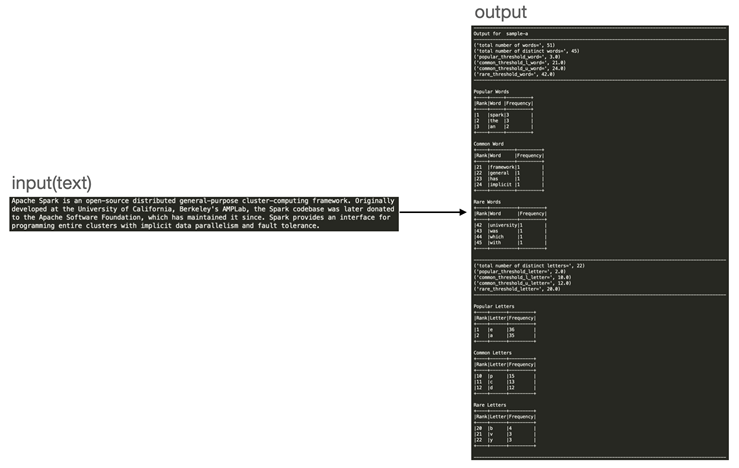

# Distributed Systems Project Kubernetes Specifications

- [Distributed Systems Project Kubernetes Specifications](#distributed-systems-project-kubernetes-specifications)
  - [Introduction](#introduction)
    - [Basic information of `Kubernetes`](#basic-information-of-kubernetes)
  - [Step 1: Kubernetes Cluster Setup (for team_member A)](#step-1-kubernetes-cluster-setup-for-team_member-a)
  - [Step 2: `Spark` Implementation of a `WordLetterCount` application on `Kubernetes` and GCP (for team_member B)](#step-2-spark-implementation-of-a-wordlettercount-application-on-kubernetes-and-gcp-for-team_member-b)
    - [Requirements](#requirements)
    - [Column meaning](#column-meaning)
    - [Notes:](#notes)
  - [Step 3: Custom-built WordLetterCount on Cloud Cluster (for team_member A)](#step-3-custom-built-wordlettercount-on-cloud-cluster-for-team_member-a)
    - [Requirements](#requirements-1)
  - [Step 4: Performance Experiments (for team_member B)](#step-4-performance-experiments-for-team_member-b)
  - [Step5: Design, Build and Evaluate a New Resource Scheduler (for team_member A)](#step5-design-build-and-evaluate-a-new-resource-scheduler-for-team_member-a)
    - [Step 5a: Static Allocation](#step-5a-static-allocation)
    - [Step 5b: Dynamic Allocation](#step-5b-dynamic-allocation)
    - [Tips](#tips)
      - [TIP: Kubernetes Scheduling Principles](#tip-kubernetes-scheduling-principles)
      - [TIP: Kubernetes custom-scheduler](#tip-kubernetes-custom-scheduler)
  - [Step 6: Conclusion and Report (for each team_member)](#step-6-conclusion-and-report-for-each-team_member)

## Introduction

The goal of this project is to deploy and manage a prototype cloud cluster
running batch processing applications and design your own resource scheduler.
To complete the project, you need to take the following steps:

1. Configure and setup a `Kubernetes` cluster on Google Cloud Platform (GCP).
2. Develop a WordLetterCount application using `Spark` APIs and execute this on a `Spark` framework running on the GCP `Kubernetes` cluster as described and configured in Step 1.
3. Develop your own `WordLetterCount` batch processing application without using any `Spark` APIs. Execute your code on the `Kubernetes` cluster.
4. Compare the performance of some applications running concurrently on the Cloud cluster in various scenarios.
5. Design, build and evaluate your own resource scheduler to achieve certain performance goals given below
6. Write an individual report to describe the development process of your project, the design of the scheduler, your individual contribution to the project and to present, discuss the performance evaluation results and troubleshooting points.

The project is structured in a way to emulate the process of producing a systems research paper. You will first deploy the execution environment (Step 1). You will then develop an application using existing APIs (Step 2). You then implement an application using your own design (Step 3). In Step 4, you measure the performance of the two applications and compare their execution times. In Step 5a, you propose a new resource scheduler based on the evaluation result from Step 4. In Step 5b, you propose a new online scheduler based on your experiences of the whole project. Finally, in Step 6 you produce the whole project report.

Each student can use Google Cloud Platform (GCP) with your own google account. GCP offers a free trial package that gives you $300 in credits for 90 days. By using this, you can setup your Kubernetes cluster environment. You can only use at most 8 CPU resources simultaneously for Free Trial.

You are supposed to do this project in a team of two, and we have indicated the member who needs to do the task in each step so that the workload can be divided equally. However, since this is for help only, it is not necessary to strictly follow it, and detailed contributions should be written in a personal report.

### Basic information of `Kubernetes`

1. [https://cloud.google.com/kubernetes-engine/docs](https://cloud.google.com/kubernetes-engine/docs)
2. [https://kubernetes.io/docs/home/](https://kubernetes.io/docs/home/)

## Step 1: Kubernetes Cluster Setup (for team_member A)

Write a script to automatically configure and launch a Kubernetes cluster on GCP.
The reference architecture must include 1 master node of instance type
`Ubuntu-E2-standard-2`(vCPU2, 4GB) and 3 worker nodes of instance type
`Ubuntu-E2-standard-2` (vCPU2, 4GB).

In this step, you should use a CLI interface to do following operations:

- Description of the Kubernetes cluster by specifying the number of nodes, instance type, region, zone, etc.
  - Review and edit of the Kubernetes cluster definition/configuration created in 1
- Creation of the cluster described in 1 on GCP
  - Verification that the cluster is created successfully
  - Deployment of a dashboard to access the cluster by the web-based dashboard
  - Connecting to the web-based dashboard of the cluster
- Browsing the cluster information, including status of all nodes
  - Extraction of the credentials required for connecting to the dashboard
- Deletion of the cluster and its information

## Step 2: `Spark` Implementation of a `WordLetterCount` application on `Kubernetes` and GCP (for team_member B)

### Requirements

Using the `Spark` APIs, develop an application that implements an extended version of the popular WordCount batch processing example. The application should count the number of occurrences of words and letters in the input document and categorize words/letters in three groups of popular, rare and common words/letters.

A word/letter is popular when it is among the highest 5% of words when sorted by their number of occurrences (i.e., top 5% of the words with the maximum frequencies) in the data file. A word/letter is rare when it is ranked amongst the lowest 5% of words by their frequency (i.e., bottom 5% of the words with minimum frequencies). A word/letter is common when it can be ranked amongst the middle 5% of words, sorted in a descending order by their word frequency (i.e., ranked in range [47.5%-52.5%] of the list of words, sorted by descending order by the number of occurrences for each word).

Assume that your code takes as input a very large text file which will be available in our ETL webpage. You can write your code using `Python` or `Java`. You can directly submit your `Java-Spark` application to GCP `Kubernetes` cluster by using the `spark-submit` script. But, if you prefer to write your code in `Python`, then you need to containerize you `Python`/`Spark` application, by creating a (`Docker`) image, publishing the image to a registry, and finally pull the image and deploy your application to `Kubernetes`. (for `Spark` version 3.0.0, running `Spark` on `kubernetes` is possible.)

CLI interface: Use CLI interface to run your `Spark` WordLetterCount against an input file.

- Run Spark WordLetterCount app with given input file
  - View `Spark` app
  - Show output

Output: The raw output of your code should be of any format but needs to be organized in the format we suggest you.

The Tables need to look like below:

`words_spark`
| rank | word | category | frequency |
| :---: | :---: | :---: | :---: |
| 1 | ... | ... | ... |

`letter_spark`
| rank | letter | category | frequency |
| :---: | :---: | :---: | :---: |
| 1 | ... | ... | ... |

### Column meaning

- `rank` is a unique primary key auto-increasing index (i.e., 0,1,2, …) to words/letters found. Words/Letters are ranked by decreasing order by their frequency.
- `word`, `letter` are the word or letter found in the text
- `category` is one of the three rare, popular, or common
- `frequency` is the frequency of the words/letters in the total population

### Notes:

- Words/letters must be in lowercase and in descending order by their frequency.
- Identify words using punctuation marks.
- In your analysis ignore all words/letters with non-letter characters.
- The analysis for both words and letters should not be case sensitive.
- Tables words and letters only store results relevant to words/letters which fall into the rare, popular and common categories. You can ignore the rest of the words/letters. The order of categories stored in the tables should be: first popular, then common and finally rare.

## Step 3: Custom-built WordLetterCount on Cloud Cluster (for team_member A)

### Requirements

Without using any `Spark` APIs develop your own implementation of the WordLetterCount application as described in Step 2. Run your code on the GCP `Kubernetes` cluster created in Step 1. ( You can also use `Hadoop` API if you are familiar with it)

The implementation must include approaches for efficiently distributing and orchestrating containers and pods within cluster nodes. In particular, your code must be able to dynamically use less or more nodes (The dynamic addition/removal of containers/pods will be needed for Step 5. However, you could start your implementation without this feature). You must follow the `MapReduce` programming model (you are allowed to get inspiration from the Spark or other MapReduce implementations but you are not allowed to copy and paste any existing code). Your code should not implement any fault-tolerance features. You should only implement the following:

1. The `map()` and `reduce()` functions.
2. The input file should be read in fixed sized chunks. The chunk size should be given as an input parameter. If this is omitted then your program should use a default value.
3. Your code should implement all the necessary I/O operations for reading from the input file, sending intermediate values from the mappers to reducers, and finally writing the results to output files.

CLI interface: Use the CLI interface to run your custom-built WordLetterCount against an input file:

- Run Custom-built WordLetterCount app with given input file and chunk size as parameter
  - View custom-built app
  - Show output

Output: The output of your code should be similar or same as in the case of the Spark application. Below is the sample output (You do not need to do same).



## Step 4: Performance Experiments (for team_member B)

In this step you need to compare the performance of the previous two applications sharing the cluster of five worker nodes according to the three scenarios described below. In this step the resource allocation for the cluster is static and is given below. The files will be given to you online at the course web page.

- **scenarioA**: The custom application uses 3, 2, 1 node.
- **scenarioB**: The `Spark` application uses 3, 2, 1 node.

Report the performance results of your experiments. Produce graphs to show the performance of the applications (in terms of execution time) as a subject of the input parameters i.e., input file size (10, 20, or 50 MB) and number of nodes allocated per application under all the different scenarios.

Discuss your results on the report. Your discussion should make comments on how the performance of the applications is affected given the different input sizes and the node's configurations. Compare the performance of the two applications. Discuss the comparison result and make your conclusions. Record your results in the table.

Example of table is like below:

| exp_id | application | nodes | Data(MB) | execution_time (in secs) |
| :---: | :---: | :---: | :---: | :---: |
1|Spark| |20|?
2|Spark|3|20|?
3|Spark|2|20|?
4|Spark|1|20|?
…|…|…|…|…
16|Custom|2|50|?
17|Custom|3|50|?
18|Custom||50|?

Use the CLI interface above to run applications in the scenarios and different input sizes. When you use commands and write code, you should give the option to the user to select how many nodes to use for each application.

Include table and graph in the report.

## Step5: Design, Build and Evaluate a New Resource Scheduler (for team_member A)

In this final step you are required to design, build and evaluate a new resource scheduler to dynamically allocate worker nodes to the two applications for unknown sizes of input files.

The goal of the scheduler is to minimize the execution time for both and each one of the applications. You should assume that the two applications begin their executions simultaneously. The scheduler is allowed to control the execution time of the two applications only by adding or removing containers/pods/nodes to each of the applications. Your setup should only use the Kubernetes cluster you created in Step 1. You are asked to provide two versions of the scheduler using the approaches described below.

### Step 5a: Static Allocation

In this step, the scheduler should use a performance model derived from Step 4. The decisions of the scheduler (how many nodes to allocate for each application) should solely depend on the performance results from Step 4. Devise a performance model using the data from Step 4. Using this model, the scheduler should perform a static allocation of nodes to the two applications in order to minimize the execution time for both and each of the applications.

The static allocation performance model can be derived by measuring the runtime according to the number of allocated nodes for a given input and grasping the average number of nodes.

### Step 5b: Dynamic Allocation

In this step you should design a scheduler to dynamically allocate nodes at runtime to the two applications in order to minimize the execution time for both and each of the applications. In this case the scheduler should not use hard-coded allocation. Rather, it should dynamically learn the way the addition/removal of nodes affects the applications' performance and adjust their allocations at runtime.

After understanding the constraints and resource requirements set on the pod, you can schedule pods in kubelet through the node filtering process.

CLI interface: Use the CLI interface to run both schedulers against different input sizes.

### Tips

#### TIP: Kubernetes Scheduling Principles

When creating a Pod, you can assign it to a node by adding multiple conditions to the Pod's spec. In Kubernetes, a component named kube-scheduler determines the node to which the Pod will be assigned. kube-scheduler goes through a two-step process when selecting a node for a pod.

1. Filtering: Finding suitable nodes for pods
2. Scoring: Selecting the most suitable nodes among nodes found by filtering

When a user's Pod creation request is submitted to `kube-apiserver` through commands such as `kubectl` apply, `kube-apiserver` stores the Pod's information in etcd. However, the Pod information is saved without setting the NodeName value, which is the information of the node where the Pod is located.

At this point, kube-scheduler watches this information and detects that the Pod's NodeName is empty. So, kube-scheduler does some sort of scheduling task, finding the appropriate node to allocate that Pod.

Once a suitable node is found, kube-scheduler sends a message to `kube-apiserver` that says "Hey, this Pod is suitable for this node." In other words, kube-scheduler itself does not create Pods directly, it is creating Pods from the `kubelet` of the allocation node.

You can find more information about the `kubernetes` scheduler at the following website:

1. [https://kubernetes.io/docs/concepts/scheduling-eviction/kube-scheduler/](https://kubernetes.io/docs/concepts/scheduling-eviction/kube-scheduler/)

2. [https://bcho.tistory.com/1344](https://bcho.tistory.com/1344)

#### TIP: Kubernetes custom-scheduler

In most cases, you can perform the desired scheduling with only the kube-scheduler provided by default, but sometimes a separate scheduling algorithm is required. In this case, you can write the source code yourself, or you can implement the scheduler with just [a simple shell script](https://kubernetes.io/blog/2017/03/advanced-scheduling-in-kubernetes). The official Kubernetes documentation also explains examples of running multiple schedulers. However, when using a custom scheduler, you need to set spec.schedulerName when defining Pods. If you don't set this, the default scheduler is running.

You can get help writing a custom scheduler at the following websites.

1. Writing custom Kubernetes scheduler:
[https://banzaicloud.com/blog/k8s-custom-scheduler/](https://banzaicloud.com/blog/k8s-custom-scheduler/)
2. Example source code:
[https://github.com/banzaicloud/random-scheduler/blob/master/cmd/scheduler/main.go](https://github.com/banzaicloud/random-scheduler/blob/master/cmd/scheduler/main.go)
3. Example source code2:
[https://github.com/kelseyhightower/scheduler](https://github.com/kelseyhightower/scheduler)

## Step 6: Conclusion and Report (for each team_member)

Write an individual (per group member) project report. You should work independently on the report. However, the coursework is designed to be a team-work project and both group members should equally work for each step of the coursework. The project report must contain the following sections.

```nothing
Step1. Spark and Kubernetes (up to 1 page)
   Outline your approach in Step 1.

Step2. Spark Application (up to 1 page)
   Outline the application implementation. Which Spark APIs did you use?

Step3. Custom-built Applications (up to 2 pages)
   Clearly describe how you designed and implemented the application.

Step4. Evaluation Results (up to 2 pages)
Provide the graphs showing the performance results. Clearly describe these, discuss the comparison results and make your conclusions on how the input file sizes and the number of allocated nodes affect the performance of the applications.

Step 5. New Resource Scheduler (up to 3 pages)
a. Describe the derived performance model and outline the design of the new scheduler. Present evaluation results to clearly show the performance of the scheduler according to the specifications.
b. Describe the design of the new scheduler. Present evaluation results to clearly show the performance of the scheduler according to the specifications.

Step 6. Per Student Contribution (up to 1 page)
   a. Clearly discuss your own, individual contribution in the project.

Step 7. Conclusions (up to 1 page)
Make the conclusions of your work and discuss your future work on the resource scheduler based on your experience.
```

The project report will be due in the last day of class: Dec 15th Tue (subject to changes)
